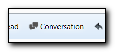

## Open Conversation Button for Thunderbird

A Thunderbird addon that adds a toolbar button to open selected email's conversation.

### Screenshot

### Installation

See `dist/` folder or visit [Mozilla addon site][amo].

### Building

    npm install
    grunt build-xpi

### License

"Open Conversation Button" is released under the [MIT License][mit].

[mit]: http://www.opensource.org/licenses/MIT
[amo]: https://addons.mozilla.org/en-US/thunderbird/addon/open-conversation-button/
